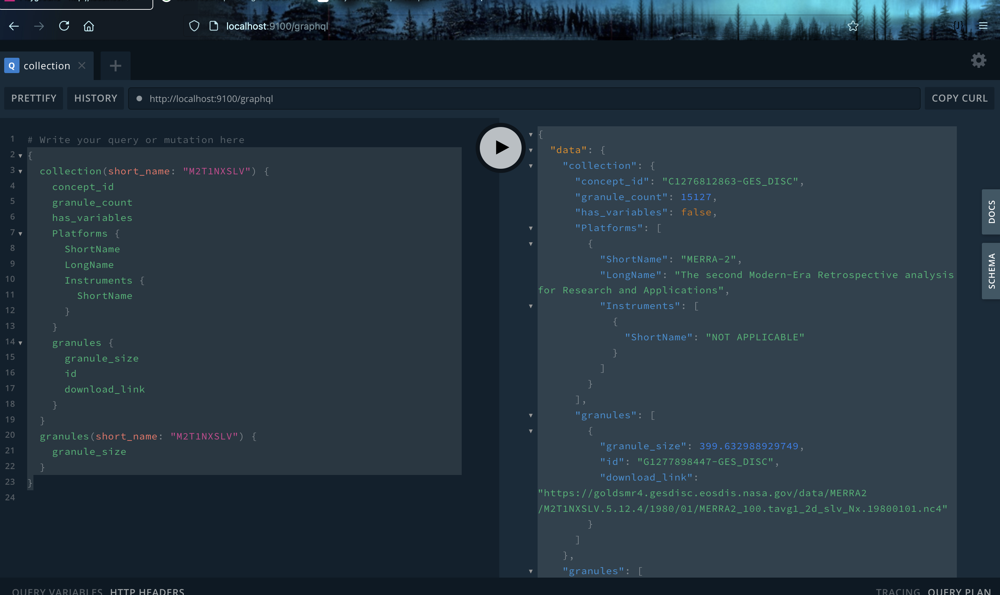

# GraphQL CMR

A graphQL server interfacing with several CMR APIs.
Used to search 3 types of top level queries:

- granules
- collections
- variables

But inside each query you can call the other queries.
Initially, a user can explore public datasets beginning
with the shortname of the dataset. Later this will be
extended to datasets with ACL.
The UI is a search-as-you-type autocomplete and gives you
suggestions of allowed key values in each node.
For a full listing of what keys are allowed, look at
the *schema* documentation located to the right side of the display.

## Additional features:

- beautify your query
- curl command copy
- history of queries

# How TO

```code
$npm install
$npm start (defaults to CMR Prod)
$CMR_ENV=uat npm start (points to UAT)
$CMR_ENV=sit npm start (points to SIT)
```

Visit localhost:9001/graphql which launches the graphQL playground UI in your browser.

## Example query
[]

## Collection search
```
{
    collection(short_name: "xxxx") {
        id
    }
}

```
Or

```
{
    collection(concept_id: "xxxx") {
        id
    }
}

```

## Granules search
```
{
    granules(short_name: "xxxx") {
        download_link
    }
}


```
Granules will support page_size and offset as follow
```
{
    granules(short_name: "xxxx", page_size: 4, offset:9) {
        download_link
    }
}


```
## Python client
For a python client library examples please refer to python_graphql_client/examples

## Expending this work
- We need to morph this work to a centralized service where a user makes the request to it without the need to install
or download anything.
- Deploy CMRgraphQL with a cloud framework such as Terraform   
- Add more clients example
- Take the advantage of multithreading to accelerate the download of the files.
- Work with CMR to serve this tool as service for the community.

# Marston 
- ~~Create ECC bit bucket~~ 
- ~~Prepare a How-To~~
- ~~Screenshots~~ 

# Navaneeth
- Prepare a powerpoint presentation

# Abdelhak
- ~~How to expend this~~
- ~~Add python client library~~
